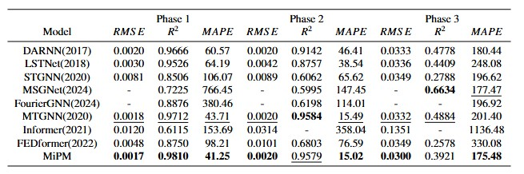
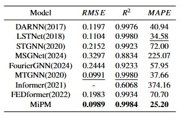

# Source code file directory description
* **Dataset**：Save the datasets collected during the three phases of the Zhang Jinggao open caisson sinking: Phase1, Phase2, and Phase3. Each phase dataset contains two csv files, namely the bottom structure stress data `stress.csv`, which is used as the exogenous driving series, and the open caisson sinking attitude data `targets.csv`, which is used as the predicted target series. The `sml2010` folder includes two csv files, which are the surrounding environment data `Environment.csv` as the exogenous driving series and the indoor temperature data `Temperature.csv` as the prediction target series.
* **logfiles**：Save the parameter adjustment process of the MiPM model four-fold cross validation
* **networks**：Save the MiPM model structure and the related files of the LSTM model structure, where `net.py` and `layer.py` save the MiPM model structure, and `LSTMModel.py` saves the LSTM model structure
* **pictures**：Save the images used in the `README` file
* **Tools**：Save the relevant files of data preprocessing and model training and parameter adjustment process
* * **MiPM.pt**: This file saves the trained model parameters.
* **Baseline.ipynb**：Parameter tuning process of the baseline model
# Background

As a basic structure, open caissons are widely used in bridge construction. During the open caisson construction process, real-time and accurate prediction of the sinking attitude can help reduce the risk of accidents and improve the quality of the project. However, commonly used prediction models, such as statistical models and machine learning models, cannot handle the nonlinear spatio-temporal characteristics in time series data, such as structural stress, and are not suitable for the prediction of the open caisson's sinking attitude. In addition, the existing work on the prediction of the open caisson's sinking attitude cannot predict multiple open caisson attitude indicators at the same time. Therefore, this paper proposes a multi-indicator prediction model `MiPM`. The open caisson's attitude indicators: sinking depth, horizontal/vertical inclination, horizontal/vertical top opening deviation, horizontal/vertical bottom opening deviation, a total of seven indicators are predicted. During the open caisson's sinking process, changes in the open caisson's attitude lead to changes in the bottom structural stress. This paper uses structural stress as auxiliary data to improve the prediction accuracy of the model.
## Introduction to seven open caisson attitude indicators
As shown in the horizontal position diagram of the open caisson, four sensors are arranged around the open caisson to collect the three-dimensional coordinates $x, y, z$ of the point respectively, and calculate the seven attitude indicators of the open caisson according to the setting of the open caisson specifications: 

* **Sinking depth**：The sinking depth of the center point of the top of the open caisson. For example, in the horizontal position diagram of the caisson, the three-dimensional coordinates of the center point of the open caisson are the average of the three-dimensional coordinates of the four sides. The sinking depth of the open caisson refers to the sinking height of $z$ within a period of time.。

* **Horizontal inclination**：The horizontal direction represents the upstream and downstream directions. When the open caisson is tilted toward the downstream, the horizontal inclination is positive. As shown in the horizontal position diagram of the open caisson, when the open caisson is tilted on the upstream and downstream axis, it is defined as the horizontal inclination.

* **Vertical inclination**：The vertical direction represents the direction of Rugao and Zhangjiagang. When the open caisson is tilted toward Zhangjiagang, the vertical inclination is positive. As shown in the vertical position diagram of the open caisson, when the open caisson is tilted on the axis of Zhangjiagang and Rugao, the vertical inclination is defined as.

* **Bottom deviation(Horizontal, vertical)**：The bottom opening deviation represents the horizontal and vertical deviation between the real-time position of the center point of the bottom opening of the open caisson and the preset center point position. As shown in the open caisson bottom opening position diagram, the white dotted line frame and its axis are the predefined center open position, the yellow solid line frame and its axis are the actual caisson position, and the horizontal and vertical deviations between the axes are the bottom opening deviation of the open caisson.

* **Top deviation(Horizontal, vertical)**：The top opening deviation refers to the horizontal and vertical deviation between the real-time position of the center point of the top opening of the open caisson and the preset center point position.

             
沉井横向位置图
 

             
沉井纵向位置图
 

             
沉井底口位置图
 

# MiPM
## Model architecture

A deep learning model is established based on convolutional neural networks and graph neural networks to extract the spatio-temporal characteristics between the sinking attitude data of the open caisson and the structural stress, and predict the sinking attitude of the open caisson. The model is mainly divided into a graph learning layer, a time convolution module, a graph convolution module, and an input-output module.

             
Architecture of MiPM
 

Graph convolutional neural networks require a graph adjacency matrix. This paper uses GRU and self-attention mechanism to dynamically establish the graph adjacency matrix between the sinking atttitude and structural stress of the open caisson to improve the prediction accuracy of the model.

             
Graph learning layer architecture diagram
 

During the sinking process of the open caisson, the attitude of the open caisson and the stress of the bottom structure change with time. The value of the previous moment affects the next moment. This paper uses a 1D extended convolutional layer to capture the temporal characteristics of multivariate time series data and learn the temporal relationship between the sinking attitude of the open caisson and the structural stress.

             
Temporal convolution module architecture diagram
 

During the sinking process of the open caisson, the change of the open caisson attitude will lead to the change of the structural stress at the bottom of the open caisson, and structural stress points are arranged at different positions at the bottom of the open caisson, and different points also affect each other. This paper uses graph neural networks to extract spatial features between multivariate time series data.

             
Graph convolution module architecture diagram
 

## Model training and prediction process

First, the model training and prediction process is explained with pseudo code, such as Algorithm 1. Algorithm 1 mainly includes three parts: data reconstruction, model training, and model prediction. Among them, data reconstruction refers to the reconstruction of the original data in a sliding window manner; model training refers to adjusting the model parameters with the training set to obtain a trained model; model prediction refers to calculating the prediction accuracy of the model with the test set. In addition, in order to make Algorithm 1 clearer, the model training and prediction process is further explained in a visual way, as shown in the figure below. 

**Algorithm1：** Model training and prediction process

**Input：** Structural stress series ***XX***, open caisson sinking attitude series ***YY***, time window size *J*, MiPM model hyperparameters *params*, model training times *epoches*, model learning rate *lr*, batch size *B*

**Output：** Single-step prediction accuracy of open caisson sinking attitude $RMSE,\MAPE,\R^2$

1. According to the time window size *J*, reconstruct the data of ***XX*** and ***YY*** to obtain *Dataset*, divide *Dataset* to obtain *trainSet*, *valSet*, *testSet*

   //Model training process

2. $model \leftarrow MiPM.init(params)$ //Initialize the MiPM model according to *params* and get *model*

3. $for\ epoch\ in\ range(l,\ epochs+1):$

4. &emsp; $for\ input, \ target\ in\ trainSet:$
5. &emsp;&emsp; $pred = model.forward(input)$ //Forward propagation, calculate the predicted value of the sinking attitude of the open caisson $pred$   
6. &emsp;&emsp; $loss = MSELoss(pred, target)$ //Calculate the $MSE$ loss $loss$ based on the attitude prediction value $pred$ and the attitude measured value $target$                     
7. &emsp;&emsp; $gradients = model.backward(loss)$ //Back propagation, calculating gradients                     
8. &emsp;&emsp; $model.updateParameters(gradients, lr)$ //Update model parameters according to model learning rate *lr*              
9. &emsp; $end\ for$
10. $end\ for$
11. $for\ input, \ target\ in\ testSet:$
12. &emsp; $pred = model.forward(input)$ //Forward propagation, calculate the predicted value of the sinking attitude of the open caisson $pred$      
13. &emsp; $preds.add(pred), targets.add(target)$ //Save the predicted value of the sinking attitude of the open caisson and its corresponding measured value
14. $end\ for$
15. $return\ metric(preds,\ targets)$ //Calculate the prediction accuracy of the model $RMSE,\MAPE,\R^2$ and return

             
Model training and prediction visualization
 

# Baseline model parameter settings

For the following baseline models, this paper adjusts the parameters according to the original model network structure of the reference and the data set of this paper, and gives the parameter selection range and setting results.
## DARNN

* @article{qin2017dual,
    title={A dual-stage attention-based recurrent neural network for time series prediction},
    author={Qin, Yao and Song, Dongjin and Chen, Haifeng and Cheng, Wei and Jiang, Guofei and Cottrell, Garrison},
    journal={arXiv preprint arXiv:1704.02971},
    year={2017}
  }
* https://github.com/sunfanyunn/DARNN
* Parameter selection range：hidden_size：[16, 32, 64, 128], dropout: [0.1, 0.2, 0.3, 0.4]
* Parameter setting: hidden_size:128, dropout: 0.1

## LSTNet

* @inproceedings{lai2018modeling,
    title={Modeling long-and short-term temporal patterns with deep neural networks},
    author={Lai, Guokun and Chang, Wei-Cheng and Yang, Yiming and Liu, Hanxiao},
    booktitle={The 41st international ACM SIGIR conference on research \& development in information retrieval},
    pages={95--104},
    year={2018}
  }
* https://github.com/laiguokun/LSTNet
* Parameter selection range：hidden_size: [16, 32, 64, 128], d_model: [80, 120, 160], filter_size: [4, 6, 9], dropout: [0.1, 0.2, 0.3, 0.4], highway_window: [8, 16, 32]
* Parameter setting: hidden_size: 64, d_model: 160, filter_size: 4, dropout: 0.30000000000000004, highway_window: 16

## STGNN

* @inproceedings{wang2020traffic,
    title={Traffic flow prediction via spatial temporal graph neural network},
    author={Wang, Xiaoyang and Ma, Yao and Wang, Yiqi and Jin, Wei and Wang, Xin and Tang, Jiliang and Jia, Caiyan and Yu, Jian},
    booktitle={Proceedings of the web conference 2020},
    pages={1082--1092},
    year={2020}
  }
* https://github.com/LMissher/STGNN
* Parameter selection range：d_k：[20, 30, 40], num_leayers: [1, 2, 3, 4]
* Parameter setting: d_k:20, num_layers: 1
## MSGNet

* @inproceedings{cai2024msgnet,
  title={Msgnet: Learning multi-scale inter-series correlations for multivariate time series forecasting},
  author={Cai, Wanlin and Liang, Yuxuan and Liu, Xianggen and Feng, Jianshuai and Wu, Yuankai},
  booktitle={Proceedings of the AAAI Conference on Artificial Intelligence},
  volume={38},
  number={10},
  pages={11141--11149},
  year={2024}
  }
* https://github.com/YoZhibo/MSGNet
* Parameter selection range：top_k: [1, 2, 3, 4, 5], gcn_depth: [1, 2, 3, 4], propalpha: [0.1, 0.2, 0.3, 0.4], node_dim: [10, 20, 30, 40], d_model: [80, 120, 160], dropout: [0.1, 0.2, 0.3, 0.4]
* Parameter setting：top_k: 5, gcn_depth: 1, propalpha: 0.4, node_dim: 30, d_model: 160, dropout: 0.1,  
## FourierGNN

* @article{yi2024fouriergnn,
  title={FourierGNN: Rethinking multivariate time series forecasting from a pure graph perspective},
  author={Yi, Kun and Zhang, Qi and Fan, Wei and He, Hui and Hu, Liang and Wang, Pengyang and An, Ning and Cao, Longbing and Niu, Zhendong},
  journal={Advances in Neural Information Processing Systems},
  volume={36},
  year={2024}
  }
* https://github.com/aikunyi/FourierGNN
* Parameter selection range：embedding_size: [32, 64, 128, 256, 512], hidden_size: [16, 32, 64, 128]
* Parameter setting：embedding_size: 32, hidden_size: 128 
## MTGNN

* @inproceedings{wu2020connecting,
    title={Connecting the dots: Multivariate time series forecasting with graph neural networks},
    author={Wu, Zonghan and Pan, Shirui and Long, Guodong and Jiang, Jing and Chang, Xiaojun and Zhang, Chengqi},
    booktitle={Proceedings of the 26th ACM SIGKDD international conference on knowledge discovery \& data mining},
    pages={753--763},
    year={2020}
  }
* https://github.com/nnzhan/MTGNN
* Parameter selection range：layers: [1, 2, 3, 4], propalpha: [0.1, 0.2, 0.3, 0.4], subgraph_size: [2, 3, 4], out_channels: [16, 32, 64, 128], gcn_depth: [1, 2, 3, 4]
* Parameter setting: layers: 3, propalpha: 0.2, subgraph_size: 2, out_channels:64, gcn_depth:2

## Informer

* @inproceedings{zhou2021informer,
    title={Informer: Beyond efficient transformer for long sequence time-series forecasting},
    author={Zhou, Haoyi and Zhang, Shanghang and Peng, Jieqi and Zhang, Shuai and Li, Jianxin and Xiong, Hui and Zhang, Wancai},
    booktitle={Proceedings of the AAAI conference on artificial intelligence},
    volume={35},
    number={12},
    pages={11106--11115},
    year={2021}
  }
* https://github.com/zhouhaoyi/Informer2020
* Parameter selection range：factor: [3, 4, 5], d_k: [20, 30, 40], dropout: [0.1, 0.2, 0.3, 0.4]
* Parameter setting: factor: 4, d_k:40, dropout: 0.1

## FEDformer

* @inproceedings{zhou2022fedformer,
    title={Fedformer: Frequency enhanced decomposed transformer for long-term series forecasting},
    author={Zhou, Tian and Ma, Ziqing and Wen, Qingsong and Wang, Xue and Sun, Liang and Jin, Rong},
    booktitle={International conference on machine learning},
    pages={27268--27286},
    year={2022},
    organization={PMLR}
  }
* https://github.com/MAZiqing/FEDformer
* Parameter selection range：d_k: [20, 30, 40], dropout: [0.1, 0.2, 0.3, 0.4]
* Parameter setting: d_k:40, dropout: 0.1
# Experimental environment
* Server hardware configuration: operating system is Ubuntu 18.04.6 LTS, graphics card model is RTX A5000 GPU, CPU model is Intel Xeon Gold 6230R CPU。
* Software environment: python3.9, pytorch2.10GPU
# Run code
`Python run.py`
When running different datasets, modify the `dpath` and `tpath` file paths in `run.py`, where `dpath` represents the exogenous driving series file path and `tpath` represents the predicted target series file path.
# Experimental result

Each model in this paper predicts seven attitude indicators of the open caisson, and uses the correlation coefficient R2, root mean square error RMSE, and mean absolute percentage error MAPE as evaluation indicators. In addition, to verify the generalization ability of the model, single-step prediction is also performed on the sml2010 dataset, and the prediction accuracy is compared. The prediction results of each model on each dataset are shown in the following table.

             
Prediction results of each model on the open caisson attitude dataset
 

             
Prediction results of each model on the sml2010 dataset
 

