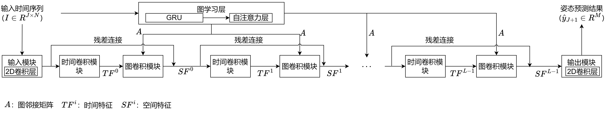

# 文件目录说明
* **Dataset**：保存底部结构应力数据以及沉井下沉姿态数据，主要包括两个csv文件，`stress.csv`保存底部结构应力数据、`targets.csv`保存沉井下沉姿态数据
* **logfiles**：保存MiPM模型四折交叉验证的调参过程
* **Modelpkl**：保存训练好的基线模型，包括`LR`、`LSTM`、`XGBoost`，以便用于计算模型对测试集的预测精度
* **networks**：保存MiPM模型结构以及LSTM模型结构的相关文件，其中`net.py`以及`layer.py`保存MiPM模型结构，`LSTMModel.py`保存LSTM模型结构
* **pictures**：保存`README`文件中所使用到的图片
* **Tools**：保存数据预处理以及模型训练调参过程的相关文件
* **Baseline.ipynb**：基线模型`LR`、`LSTM`、`XGBoost`、`RF`的参数调优过程
# MiPM

## 背景

沉井作为基础结构，在桥梁建造中，被广泛应用。在沉井建造过程中，实时准确的下沉姿态预测，有助于降低事故风险，提高工程质量。然而，常用的预测模型，如统计模型、机器学习模型，无法处理时序数据中的非线性时空特性，如结构应力，不适用于沉井下沉姿态的预测。另外，现有的针对沉井下沉姿态预测进行的工作，无法同时对沉井多个姿态指标进行预测。因此，本文提出了多指标预测模型MiPM。对沉井的姿态指标：下沉量、横/纵向倾斜度、横/纵向顶口偏位、横/纵向底口偏位，共七个指标进行预测。在沉井下沉过程中，沉井姿态的变化导致底部结构应力的变化，本文使用结构应力作为辅助数据，提高模型的预测精度。
## 七个沉井姿态指标介绍
如沉井横向位置图所示，沉井四周布置四个传感器，分别收集该点位的三维坐标$x,y,z$，依据沉井规格的设定，计算沉井的七个姿态指标

* **下沉量**：沉井顶口中心点的下沉量，如沉井横向位置图中，沉井中心点的三维坐标为四侧三维坐标的均值，沉井下沉量即是指一段时间内的$z$的下沉高度。

* **横向倾斜度**：横向代表上游和下游的方向，当沉井偏向下游时，横向倾斜度为正。如沉井横向位置图中，当沉井在上下游轴线上的倾斜，定义为横向倾斜度

* **纵向倾斜度**：纵向代表如皋和张家港的方向，当沉井偏向张家港时，纵向倾斜度为正。如沉井纵向位置图中，当沉井在张家港和如皋轴线上的倾斜，定义为纵向倾斜度

* **底口偏位（横向、纵向）**：代表沉井底口中心点的实时位置与预设中心点位置的横纵向偏差。如沉井底口位置图所示，白色虚线框及其轴心是预定义的中心位置，黄色实线框及其轴心是实际沉井的位置，轴心之间横纵方向的偏差沉井的底口偏位

* **顶口偏位（横向、纵向）**：代表沉井顶口中心点的实时位置与预设中心点位置的横纵向偏差。依据底口偏位，顶口偏位同理

             
沉井横向位置图
 

             
沉井纵向位置图
 

             
沉井底口位置图
 

## 模型结构

基于卷积神经网络以及图神经网络建立深度学习模型，提取沉井下沉姿态数据以及结构应力之间的时空特征，预测沉井的下沉姿态。该模型主要分为图学习层、时间卷积模块、图卷积模块、输入输出模块。

             
模型的总体架构图
 

图卷积神经网络需要图邻接矩阵，本文使用GRU以及自注意力机制动态建立沉井下沉姿态以及结构应力之间的图邻接矩阵，提高模型的预测精度

             
图学习层架构图
 

沉井下沉过程中，沉井的姿态以及底部结构应力都是随时间变化，上一时刻的值影响下一时刻，本文使用1D扩展卷积层捕获多元时序数据的时间特征，学习沉井下沉姿态以及结构应力的时间关系

             
时间卷积模块架构图
 

在沉井下沉过程中，沉井姿态的变化会导致沉井底部结构应力的变化，且沉井底部不同位置都布置了结构应力点位，不同点位之间也是相互影响的。本文使用图神经网络来提取多元时序数据之间的空间特征。

             
图卷积模块架构图
 

## 模型训练与预测过程

             
模型训练与预测可视化
 

# Run code
`Python run.py`

# 基线模型参数设置

针对以下基线模型，本文根据参考文献的原模型网络结构以及本文的数据集，进行调参，给出参数的选择范围以及设置结果。
## RM

* 参数选取范围：n_estimator:[100, 200, 300, 400, ..., 2000], max_depth:[1, 2, 3, ..., 10], min_samples_leaf: [1, 2, 3, ..., 10]
* 参数设置：n_estimator: 600, max_depth: 10, min_samples_leaf: 1

## XGBoost

* 参数选取范围：n_estimator:[100, 200, 300, 400, ..., 2000], max_depth:[1, 2, 3, ..., 10]
* 参数设置：n_estimator: 1200, max_depth: 6
## LSTM

* 为了简单起见，本文将LSTM网络的循环次数设置为1
## DARNN

* @article{qin2017dual,
    title={A dual-stage attention-based recurrent neural network for time series prediction},
    author={Qin, Yao and Song, Dongjin and Chen, Haifeng and Cheng, Wei and Jiang, Guofei and Cottrell, Garrison},
    journal={arXiv preprint arXiv:1704.02971},
    year={2017}
  }
* https://github.com/sunfanyunn/DARNN
* 参数选取范围：hidden_size：[16, 32, 64, 128], dropout: [0.1, 0.2, 0.3, 0.4]
* 参数设置: hidden_size:128, dropout: 0.1

## LSTNet

* @inproceedings{lai2018modeling,
    title={Modeling long-and short-term temporal patterns with deep neural networks},
    author={Lai, Guokun and Chang, Wei-Cheng and Yang, Yiming and Liu, Hanxiao},
    booktitle={The 41st international ACM SIGIR conference on research \& development in information retrieval},
    pages={95--104},
    year={2018}
  }
* https://github.com/laiguokun/LSTNet
* 参数选取范围：hidden_size: [16, 32, 64, 128], d_model: [80, 120, 160], filter_size: [4, 6, 9], dropout: [0.1, 0.2, 0.3, 0.4], highway_window: [8, 16, 32]
* 参数设置: hidden_size: 64, d_model: 160, filter_size: 4, dropout: 0.30000000000000004, highway_window: 16

## STGNN

* @inproceedings{wang2020traffic,
    title={Traffic flow prediction via spatial temporal graph neural network},
    author={Wang, Xiaoyang and Ma, Yao and Wang, Yiqi and Jin, Wei and Wang, Xin and Tang, Jiliang and Jia, Caiyan and Yu, Jian},
    booktitle={Proceedings of the web conference 2020},
    pages={1082--1092},
    year={2020}
  }
* https://github.com/LMissher/STGNN
* 参数选取范围：d_k：[20, 30, 40], num_leayers: [1, 2, 3, 4]
* 参数设置: d_k:20, num_layers: 1
## WaveForM

* @inproceedings{yang2023waveform,
  title={WaveForM: Graph enhanced wavelet learning for long sequence forecasting of multivariate time series},
  author={Yang, Fuhao and Li, Xin and Wang, Min and Zang, Hongyu and Pang, Wei and Wang, Mingzhong},
  booktitle={Proceedings of the AAAI Conference on Artificial Intelligence},
  volume={37},
  number={9},
  pages={10754--10761},
  year={2023}
  }
* https://github.com/alanyoungCN/WaveForM
* 参数选取范围: dropout: [0.1, 0.2, 0.3, 0.4], subgraph_size: [1, 2, 3, 4, 5, 6] , node_dim: [20, 30, 40], n_gnn_kayer: [1, 2, 3, 4]
* 参数设置：dropout: 0.3, subgraph_size: 6, node_dim: 40, n_gnn_layer: 3
## MSGNet

* @inproceedings{cai2024msgnet,
  title={Msgnet: Learning multi-scale inter-series correlations for multivariate time series forecasting},
  author={Cai, Wanlin and Liang, Yuxuan and Liu, Xianggen and Feng, Jianshuai and Wu, Yuankai},
  booktitle={Proceedings of the AAAI Conference on Artificial Intelligence},
  volume={38},
  number={10},
  pages={11141--11149},
  year={2024}
  }
* https://github.com/YoZhibo/MSGNet
* 参数选取范围：top_k: [1, 2, 3, 4, 5], gcn_depth: [1, 2, 3, 4], propalpha: [0.1, 0.2, 0.3, 0.4], node_dim: [10, 20, 30, 40], d_model: [80, 120, 160], dropout: [0.1, 0.2, 0.3, 0.4]
* 参数设置：top_k: 5, gcn_depth: 1, propalpha: 0.4, node_dim: 30, d_model: 160, dropout: 0.1,  
## FourierGNN

* @article{yi2024fouriergnn,
  title={FourierGNN: Rethinking multivariate time series forecasting from a pure graph perspective},
  author={Yi, Kun and Zhang, Qi and Fan, Wei and He, Hui and Hu, Liang and Wang, Pengyang and An, Ning and Cao, Longbing and Niu, Zhendong},
  journal={Advances in Neural Information Processing Systems},
  volume={36},
  year={2024}
  }
* https://github.com/aikunyi/FourierGNN
* 参数选取范围：embedding_size: [32, 64, 128, 256, 512], hidden_size: [16, 32, 64, 128]
* 参数设置：embedding_size: 32, hidden_size: 128 
## MTGNN

* @inproceedings{wu2020connecting,
    title={Connecting the dots: Multivariate time series forecasting with graph neural networks},
    author={Wu, Zonghan and Pan, Shirui and Long, Guodong and Jiang, Jing and Chang, Xiaojun and Zhang, Chengqi},
    booktitle={Proceedings of the 26th ACM SIGKDD international conference on knowledge discovery \& data mining},
    pages={753--763},
    year={2020}
  }
* https://github.com/nnzhan/MTGNN
* 参数选取范围：layers: [1, 2, 3, 4], propalpha: [0.1, 0.2, 0.3, 0.4], subgraph_size: [2, 3, 4], out_channels: [16, 32, 64, 128], gcn_depth: [1, 2, 3, 4]
* 参数设置: layers: 3, propalpha: 0.2, subgraph_size: 2, out_channels:64, gcn_depth:2

## Informer

* @inproceedings{zhou2021informer,
    title={Informer: Beyond efficient transformer for long sequence time-series forecasting},
    author={Zhou, Haoyi and Zhang, Shanghang and Peng, Jieqi and Zhang, Shuai and Li, Jianxin and Xiong, Hui and Zhang, Wancai},
    booktitle={Proceedings of the AAAI conference on artificial intelligence},
    volume={35},
    number={12},
    pages={11106--11115},
    year={2021}
  }
* https://github.com/zhouhaoyi/Informer2020
* 参数选取范围：factor: [3, 4, 5], d_k: [20, 30, 40], dropout: [0.1, 0.2, 0.3, 0.4]
* 参数设置: factor: 4, d_k:40, dropout: 0.1

## FEDformer

* @inproceedings{zhou2022fedformer,
    title={Fedformer: Frequency enhanced decomposed transformer for long-term series forecasting},
    author={Zhou, Tian and Ma, Ziqing and Wen, Qingsong and Wang, Xue and Sun, Liang and Jin, Rong},
    booktitle={International conference on machine learning},
    pages={27268--27286},
    year={2022},
    organization={PMLR}
  }
* https://github.com/MAZiqing/FEDformer
* 参数选取范围：d_k: [20, 30, 40], dropout: [0.1, 0.2, 0.3, 0.4]
* 参数设置: d_k:40, dropout: 0.1
# 实验结果

本文各模型对沉井的七个姿态指标进行预测，并使用相关系数R2、均方根误差RMSE、平均绝对百分比误差MAPE，作为评价指标。各模型的预测结果如下表。

             
各模型的预测结果
 

